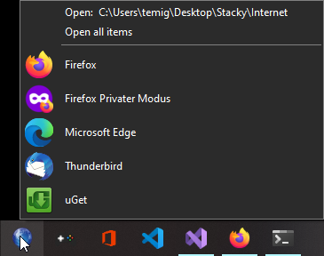
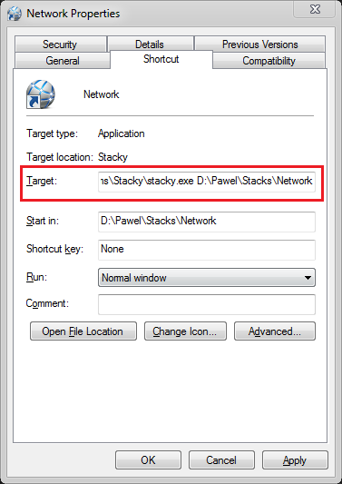
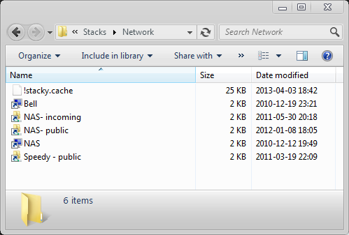
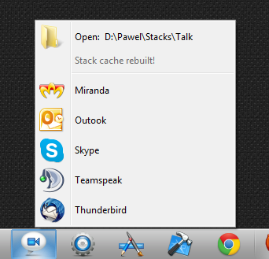
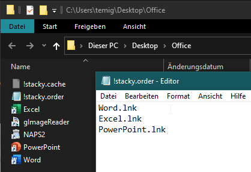
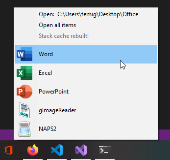

<table>
      <tr>
            <td></td>
            <td><h1>Stacky</h1><p>Simple icon stacks solution for Windows</p></td>
      </tr>
</table>

Stacky is a small program for Windows that displays contents of a given directory as a list of clickable, labled icons.

This version has a few bug fixes and additions. Original project by [Paweł Turlejski](https://github.com/pawelt/stacky), with fixes from [Josh Dague](https://github.com/daguej/stacky), [AnnanFay](https://github.com/AnnanFay/stacky/commits/master), [Egor Egorov](https://github.com/egigoka/stacky/commits/master) and well, me.

You can read the original blog post in the web archive: [justafewlines.com/2013/04/stacky](https://web.archive.org/web/20160403223409/http://justafewlines.com/2013/04/stacky/)


> Stacky in dark mode running on Windows 10

## Requirements

Stacky needs [Visual C++ Redistributable for Visual Studio 2015 - 2022](https://aka.ms/vs/17/release/vc_redist.x64.exe)

## Download

I compiled it again and it works perfectly fine on Windows 10.

Just download `stacky-x64.zip` and unzip. No installation required.

<a href="https://github.com/FelisDiligens/stacky/blob/master/binaries/stacky-x64.zip?raw=true">
      
</a>


## Compilation

You can build Stacky with free Microsoft tools, using solution file in the `vsproj` directory.

Full source code is available in `src` directory.


## How to use it

### Create a shortcut

1. Create a regular windows shortcut to `stacky.exe`.
2. Create a folder and put shortcuts to your programs there.
3. Edit the shortcut and add the folder's path to the `Target` field, so it looks something like this:

      `D:\pawel\Programs\Stacky\stacky.exe  D:\pawel\Stacks\Network`

      
      
4. Drag the stack shortcut to your taskbar.

That's all. You can click the Stacky shrotcut on the taskbar to open the new stack.

### Stack folder

You can easily access the stack folder via the link at the top of each stack, thats says:

`Open: D:\pawel\Stacks\Network`



As you can see, there is a !stacky.cache file in there (hidden by default), where Stacky keeps all cached icons for this stack. Of course, Stacky works regardless of task bar position (left, right, top or bottom):



### Change the order

You can change the order of how the items get displayed. Create a `!stacky.order` file in the stack folder and write each file in a line like so:
```
Word.lnk
Excel.lnk
PowerPoint.lnk
```
If you haven't included all files in the `!stacky.order` file, the rest will be appended in alphabetical order.

The folder looks like this:  


And the result looks like this:  


## Why is it useful

You can replace a bunch of icons on your taskbar with one icon. 

Say you use Photoshop, Illustrator, Axure and couple other design-related programs. Instead of putting individual shortucts in your taskbar, you can create a folder called "Design", put all your design shortcuts there and create one shortcut on a taskbar.

Whenever you click on the icon, you will see all the icons you put in the folder, ready to launch.

If you have 30+ programs, it is really convenient to split them into couple groups, instead of squizing in all icons right in the taskbar.

Stacks with shortcuts to folders to your projects, movies, pictures and anything else work great too.

## Why would you use Stacky instead of...

There are couple products on the market that do similar thing, like [RocketDock](http://rocketdock.com/) or [7stacks](http://alastria.com/software/7stacks/). In fact, I used 7stacks for quite some time. These are fine products, but stacky has some unique features that you may like:

- it is open source and 100% free
- it does one thing and does it well
- it's very small, requires no installation, no external configuration etc.
- but most of all, it's the fastest available solution


## Why is it so fast?

Because Stacky caches stacked icons. Instead of reading and analyzing `.lnk` files (Windows shortcuts), and then fetching icons from corresponding executables every time you open a stack, Stacky stores all icons in one small file in the stack folder. When user opens a stack, no `.lnk` file nor `.exe` files are touched. Only Stacky cache file.

Any time the shortcuts folder is modified (new shrtcut is added etc.), the cache is rebuilt.

7stacks every now and then makes you wait good couple seconds, before it renders the stack. Stacky never, ever does it. Stacks are displayed immediately, every time.

That's why stacky is faster than anything I've seen so far.
